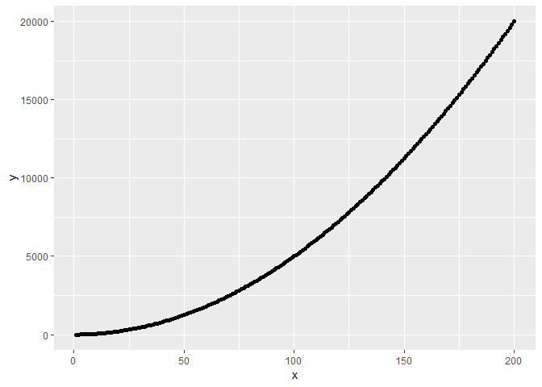

hw07-lsloboda
================

-   [Building your own R package](#building-your-own-r-package)
    -   [Problem](#problem)
    -   [Background](#background)
    -   [Method](#method)
    -   [Main Function Code](#main-function-code)
    -   [Unit Tests](#unit-tests)
    -   [Examples](#examples)
    -   [Documentation](#documentation)
    -   [Resources](#resources)

Building your own R package
===========================

Problem
-------

The objective of the assignment is to build, test and document a new R package. I decided to add a Box-Cox transformation to the *powers* package from class.

Background
----------

The Box-Cox transformation is used to make a non-normal distribution into a normal distribution, allowing normal-dependent tests (e.g. t-tests) to be conducted on the data. The power transformation factor, or *λ*, is estimated using a variety of techniques, such as maximum likelihood estimate (MLE) or a root-finding method such as Newton-Raphson. The power transformation factor is then applied to the data to, ideally, achieve normalized data. The Box-Cox transformation can only be used on positive data, so negative values must be shifted to be positive before applying the method.

*y*<sub>*i*</sub><sup>*λ*</sup> = (*y*<sub>*i*</sub><sup>*λ*</sup> − 1)/*x*, if *λ* ≠ 0

*y*<sub>*i*</sub><sup>*λ*</sup> = *l**n**y*<sub>*i*</sub>, if *λ* = 0

Different methods of estimation and transformation are useful in different scenarios (as discussed [here](https://arxiv.org/ftp/arxiv/papers/1401/1401.3812.pdf)). Implementing a rigorous Box-Cox algorithm would require a family of functions.

For simplification, I will focus only on the **transformation step** for two cases: *λ* = 0 and *λ* ≠ 0. I will apply user-defined values for the positive shift value and the estimate of *λ*.

Method
------

These are general steps that I used to create a package in R:

-   Seed the repo with the original *powers* package, using a ZIP file
-   Create a new R script for the new function
-   Define the inputs
-   Define the outputs
-   Write the function
-   Update the documentation using the appropriate roxygen2 tags
-   Regularly run devtools::document(), along with Restart + Install, to incorporate changes
-   Write unit tests to check different scenarios
-   Regularly check the function to ensure no errors occur; troubleshoot when needed
-   Update the README and vignette

Main Function Code
------------------

``` r
#' Simplified Box-Cox Transformation
#'
#' This function applies an estimate of the power transformation factor (lambda) in a deterministic power function to turn non-normal data into normal data.
#' However, since lamba is user-defined in this function, it may not necessarily result in a normal distribution. A more complex method, such as
#' maximum likelihood estimate (MLE) or Newton-Raphson, may be used to estimate the value of lamba required to achieve a Gaussian distribution, however
#' this is beyond the scope of this assignment.
#'
#' @param x Initial data set.
#' @param lambda Estimate of power transformation factor to make \code{x} a normal distribution.
#' @param delta Amount to shift x by to ensure positive values.
#' @param plot_it Display a plot of \code{x} vs the output. Use logical.
#' @return The vector \code{y}, which represents that transformation of \code{x} by the Box-Cox algorithm.

boxcox <- function(x, lambda, delta, plot_it) {

    #Set sensible defaults
    if(missing(x)){
        return(print("Function requires a dataset"))}
    if(missing(lambda)){
        return(print("Function requires an estimate for lambda"))}
    if(missing(delta)){
        delta <- 0}
    if(missing(plot_it)){
        plot_it <- TRUE}

    #Box-Cox requires positive values, so a shift value should be applied if specified
    if (delta != 0){
        x <- x + delta
    }

    #Apply Box-Cox transformation to obtain new 'normalized' data set
    if (lambda == 0){
        y <- log(x)
    } else {
        y <- ((x^lambda) - 1) / lambda
    }

    #Create plot of old vs. new data to see the transformation
    if (plot_it) print(
        ggplot2::qplot(x, y)
    )
    return(y)
}

#' @rdname boxcox
#' @export
```

We see that checking the function produces no errors:


Unit Tests
----------

I created a new R script called *test\_boxcox.R* to check three cases:

**Unit Test 1**: Check that negative x is corrected to positive values (in other words, see that the shift value does what is expected).

**Unit Test 2**: Test that *λ* = 0 applies the correct function.

**Unit Test 3**: Test that *λ* ≠ 0 applies the correct function.

If my package was able to estimate *λ*, we could also have compared my estimate to the value provided in the boxcox function already in the MASS package.

``` r
#context("Applying Box-Cox Transformation")

# test_that("The dataset is shifted by the user-specified delta value", {
#     shift <- c(50)
#     expect_identical(boxcox(1:100, 1, shift, FALSE), c( ((1:100 + shift) - 1)))
# })
# 
# test_that("$Correct function is used when lambda equals zero", {
#     expect_identical(boxcox(1:100, 0, 0, FALSE), log(1:100))
# })
# 
# test_that("$Correct function is used when lambda does not equals zero", {
#     expect_identical(boxcox(1:100, 2, 0, FALSE), ((1:100)^2 - 1) / 2)
# })
```

We see that checking the test package (in the More dropdown menu) produces no errors with a similar message as previously shown for checking the package:


Examples
--------

Now that we've written the function, written some unit tests, and checked everything, let's try running the function in a few examples. First, we will run the function with fully specified parameters as shown in the code below.

``` r
x <- 1:100
y <- boxcox(x, -1, 50, TRUE)
```


From the plot, we observe that the data has been transformed as expected from the function. It works! Let's try some different argument just to be sure.

``` r
x <- 1:200
y <- boxcox(x, 2, 0, TRUE)
```



Looking good so far! Next, we will ensure the the defaults work when fewer arguments are specified.

``` r
x <- 1:100
y <- boxcox(x, 1.5)
```


We can see that the missing function is correctly applying the default options when the optional argument are omitted. Lastly, let's see if the function fails when the mandatory argument are omitted.

``` r
x <- 1:200
y <- boxcox()
```

    ## [1] "Function requires a dataset"

``` r
z <- boxcox(x)
```

    ## [1] "Function requires an estimate for lambda"

The correct error messages show up when the mandatory arguments are missing, just as we expect!

Since my function doesn't actually estimate the power transformation factor, we won't bother to check whether the normality of the data has improved or not. If this function estimated *λ* and applied the transformation, this would be important to verify. Additionally, in a more realistic scenario, it would also be a good idea to limit the use of this function to a range of roughly −3 &lt; *λ* &lt; 3, as the Box-Cox transformation is only valid for small transformations.

Documentation
-------------

When creating a new function, it's important to provide documentation so that other users (or possibly your future self) can understand, implement and update the function. In this case, documentation for the function was updated in the README file (including installation instructions) and the vignette. The roxygen2 parameters were also used to add a help section regarding the function when ?boxcox is entered in the console, which looks like this:


Resources
---------

<https://help.github.com/articles/merging-an-upstream-repository-into-your-fork/> <https://ncss-wpengine.netdna-ssl.com/wp-content/themes/ncss/pdf/Procedures/NCSS/Box-Cox_Transformation.pdf> <https://arxiv.org/ftp/arxiv/papers/1401/1401.3812.pdf> <https://www.isixsigma.com/tools-templates/normality/making-data-normal-using-box-cox-power-transformation/> <https://www.ee.ucl.ac.uk/~mflanaga/java/BoxCox.html> <https://github.com/statsmodels/statsmodels/issues/1309/> <https://stackoverflow.com/questions/28370249/correct-way-to-specifiy-optional-arguments-in-r-functions>
